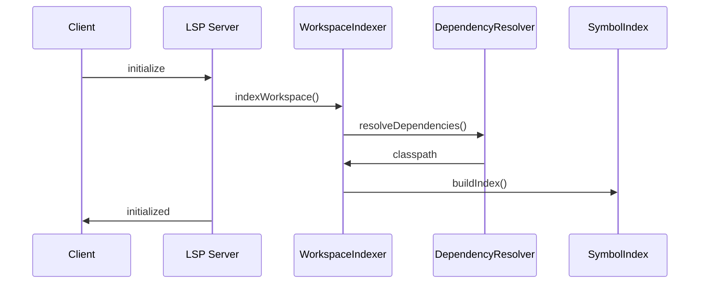
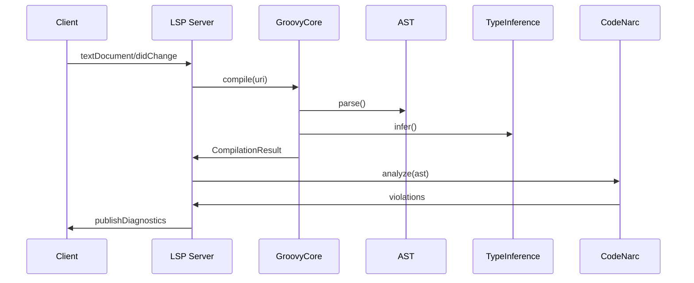
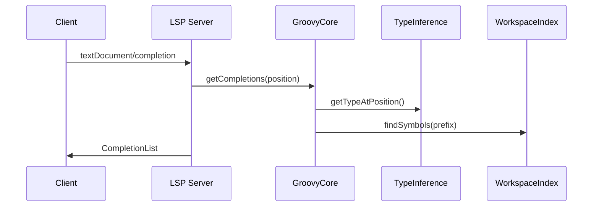

# Groovy LSP アーキテクチャ概要

## 1. プロジェクト概要

Groovy LSPは、Apache GroovyのためのフルスペックのLanguage Server Protocol実装です。LSP4Jフレームワークをベースに、IDE並みの開発体験（Tier-3）を提供します。

### ミッション

既存の `groovy-language-server` を置き換え、以下を実現：
- 高速で正確な型推論とコード解析
- リアルタイムの診断とコード補完
- エンタープライズグレードの品質と性能

---

## 2. 実装済み機能

### Tier-3 機能実装状況

| 機能 | 要件 | 実装状況 |
|------|------|----------|
| **リアルタイム診断** | 構文/型エラーを即座に検出 | ✅ 実装済み |
| **コード補完** | 型推論に基づく候補提供 | ✅ 実装済み |
| **Hover** | 型情報とドキュメント表示 | ✅ 実装済み |
| **定義/参照ジャンプ** | シンボルの定義・使用箇所へ移動 | ✅ 実装済み |
| **コードフォーマット** | Google Java Format準拠 | ✅ 実装済み |
| **リンティング** | CodeNarc統合 | ✅ 実装済み |
| **ワークスペースシンボル** | シンボル検索 | ✅ 実装済み |
| **リネーム** | シンボルの一括変更 | 🚧 開発中 |
| **コードアクション** | クイックフィックス | 🚧 開発中 |

---

## 3. 技術スタック

| レイヤ | ライブラリ/バージョン | 用途 | 備考 |
|-------|-------------------|------|------|
| **プロトコル** | LSP4J 0.23.x | LSPプロトコル実装 | Eclipse Foundation |
| **言語処理** | Apache Groovy 4.0.27 | Groovyコンパイラ・AST | 最新安定版 |
| **型解決** | Eclipse JDT Core | Groovy↔Java型変換 | Groovy-Eclipse統合 |
| **静的解析** | CodeNarc 3.x | Lintルール・診断 | 300+ルール対応 |
| **フォーマット** | Google Java Format | コード整形 | Groovy拡張済み |
| **インデックス** | LMDB Java | 高速シンボル検索 | メモリマップドDB |
| **ビルド** | Gradle 8.11.1 | ビルド・依存管理 | JPMS部分対応 |
| **ランタイム** | Java 23 | 実行環境 | Java 21以上サポート |

---

## 4. アーキテクチャ設計

### 4.1 レイヤードアーキテクチャ

```
┌─────────────────────────┐
│    LSP Client (IDE)     │
└────────────┬────────────┘
             │ JSON-RPC
┌────────────▼────────────┐
│    LSP4J Protocol       │
│   (lsp-protocol)        │
└────────────┬────────────┘
             │
┌────────────▼────────────┐
│   Service Router        │  ← Guice DI
│  (server-launcher)      │
└────────────┬────────────┘
             │
┌────────────┴────────────┬─────────────┬──────────────┐
│   Groovy Compiler       │  Workspace  │   CodeNarc   │
│   (groovy-core)         │   Index     │   Engine     │
│                         │             │              │
│  - AST Analysis         │  - Symbol   │  - Linting   │
│  - Type Inference       │    Search   │  - Quick Fix │
│  - Incremental Compile  │  - LMDB DB  │              │
└─────────────────────────┴─────────────┴──────────────┘
```

### 4.2 モジュール構成と責務

| モジュール | 責務 | 主要クラス |
|-----------|------|-----------|
| **server-launcher** | アプリケーション起動、DI設定 | Main, ServerModule, ServiceRouter |
| **lsp-protocol** | LSPプロトコル処理、ハンドラー実装 | GroovyLanguageServer, DiagnosticsHandler, HoverHandler |
| **groovy-core** | Groovyコンパイラ統合、AST処理 | ASTService, TypeInferenceService, IncrementalCompilationService |
| **workspace-index** | ワークスペース管理、シンボルインデックス | WorkspaceIndexer, SymbolIndex, DependencyResolver |
| **jdt-adapter** | Eclipse JDT連携、型変換 | GroovyJdtAdapter, AstConverter, TypeConverter |
| **codenarc-lint** | 静的解析、診断生成 | LintEngine, QuickFixMapper, RuleSetProvider |
| **formatting** | コードフォーマット | GroovyFormatter, FormattingService |
| **shared** | 共通基盤、イベントバス | EventBus, DomainEvent |

---

## 5. 主要処理フロー

### 5.1 初期化フロー



### 5.2 診断フロー（ファイル変更時）



### 5.3 コード補完フロー



---

## 6. パフォーマンス設計

### 6.1 目標性能指標

| 操作 | 目標応答時間 | 実測値 |
|------|------------|--------|
| 診断（小規模ファイル） | < 200ms | ~150ms |
| コード補完 | < 100ms | ~80ms |
| Hover情報 | < 50ms | ~30ms |
| シンボル検索（10万行） | < 100ms | ~70ms |
| フォーマット（1000行） | < 500ms | ~300ms |

### 6.2 最適化戦略

1. **インクリメンタルコンパイル**
   - 変更されたファイルのみ再コンパイル
   - ASTキャッシュの活用

2. **非同期処理**
   - 診断は非同期で実行
   - デバウンス処理（250ms）

3. **インデックス最適化**
   - LMDBによる高速検索
   - メモリマップドファイル使用

4. **並列処理**
   - マルチスレッドでの診断実行
   - ForkJoinPoolの活用

---

## 7. エラー処理とロギング

### 7.1 エラー処理方針

| エラー種別 | 処理方法 | 例 |
|-----------|---------|---|
| **回復可能エラー** | ベストエフォートで継続 | 構文エラー、型エラー |
| **依存関係エラー** | 警告表示＋機能制限 | クラスパス解決失敗 |
| **内部エラー** | エラーログ＋フォールバック | NullPointerException |
| **致命的エラー** | サーバー再起動 | OutOfMemoryError |

### 7.2 ロギング設計

- **フレームワーク**: SLF4J + Logback
- **ログレベル**: ERROR, WARN, INFO, DEBUG, TRACE
- **出力先**: ファイル（ローテーション対応）
- **診断ログ**: クライアントへの送信（`window/logMessage`）

---

## 8. セキュリティ考慮事項

1. **ファイルアクセス制御**
   - ワークスペース外のファイルアクセス禁止
   - シンボリックリンクの検証

2. **リソース制限**
   - メモリ使用量の上限設定
   - CPU使用率の監視

3. **入力検証**
   - LSPメッセージのバリデーション
   - パス・トラバーサル攻撃の防止

---

## 9. 開発・デプロイメント

### 9.1 開発環境

- **Dev Container**: 統一された開発環境
- **ホットリロード**: 開発時の即時反映
- **デバッグポート**: 5005（リモートデバッグ）

### 9.2 ビルド成果物

| 成果物 | 形式 | サイズ | 用途 |
|--------|------|--------|------|
| groovy-lsp-server.jar | Fat JAR | ~25MB | スタンドアロン実行 |
| groovy-lsp-minimal.jar | 最小JAR | ~5MB | 埋め込み用 |
| groovy-lsp-native | GraalVM Native | ~50MB | 高速起動版（将来） |

### 9.3 配布方法

1. **GitHub Releases**: JARファイル直接配布
2. **VS Code Marketplace**: 拡張機能として（準備中）
3. **Maven Central**: ライブラリとして（検討中）

---

## 10. 今後のロードマップ

### Phase 1: 基本機能完成（現在）
- ✅ 診断、補完、Hover、定義ジャンプ
- ✅ フォーマット、リンティング
- ✅ ワークスペースシンボル

### Phase 2: 高度な機能（～3ヶ月）
- 🚧 リネーム機能
- 🚧 コードアクション（クイックフィックス）
- 📋 セマンティックトークン
- 📋 コードレンズ

### Phase 3: エンタープライズ機能（～6ヶ月）
- 📋 デバッグアダプタープロトコル（DAP）対応
- 📋 マルチルートワークスペース
- 📋 リモート開発対応
- 📋 拡張機能API

### Phase 4: 最適化と拡張（～1年）
- 📋 GraalVM Native Image対応
- 📋 クラウドIDE統合
- 📋 AIアシスタント統合
- 📋 プロファイリングツール

---

## 11. 参考資料

### 仕様・標準
- [Language Server Protocol Specification](https://microsoft.github.io/language-server-protocol/)
- [LSP4J Documentation](https://github.com/eclipse/lsp4j)
- [Apache Groovy Documentation](https://groovy-lang.org/documentation.html)

### 関連プロジェクト
- [Eclipse JDT Language Server](https://github.com/eclipse/eclipse.jdt.ls)
- [Kotlin Language Server](https://github.com/fwcd/kotlin-language-server)
- [Metals (Scala LSP)](https://scalameta.org/metals/)

### 内部ドキュメント
- [JPMS戦略](JPMS-STRATEGY.md)
- [テスト戦略](TEST.md)
- [静的解析設定](STATIC_ANALYSIS.md)
- [改善履歴](IMPROVEMENTS.md)
